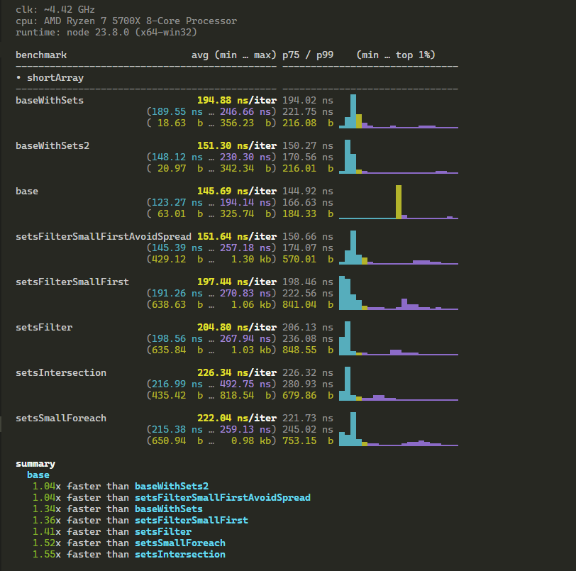
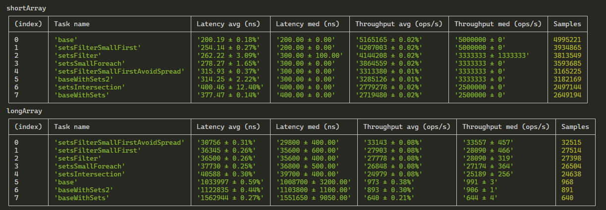

# find-common-elements

In search of best solution for array common elements problem

## Reference implementation

```js
export default function base(arr1, arr2) {
  const commonElements = []
  for (let i = 0; i < arr1.length; i++) {
    for (let j = 0; j < arr2.length; j++) {
      if (arr1[i] === arr2[j] && commonElements.indexOf(arr1[i]) === -1) {
        commonElements.push(arr1[i])
      }
    }
  }
  return commonElements
}
```

# Add new user-defined approaches

To add new approach to be tested and benchmarked, it should fulfil following requirements:

- Should be a regular function
- Ecmascript module syntax
- named function (will be used in tests and benchmarks as label)
- default exported
- be in separate file inside [approaches](./approaches/) directory

Here is an example of correctly disgned approach:

```js
export default function testApproach(arr1, arr2) {
  // some code here

  return arr1.concat(arr2)
}
```

# Running tests

Before running tests make sure all necessary dependencies to be installed via

```
npm i
```

## Compliance tests

```
npm t
```

or

```
npm run test
```

## Benchmark comparison against other approaches

Running both [mitata](https://www.npmjs.com/package/mitata) and [tinybench](https://www.npmjs.com/package/tinybench) based benchmarks

```
npm run bench
```

### Run only mitata

```
npm run bench:mitata
```



### Run only tinybench

```
npm run bench:tinybench
```


